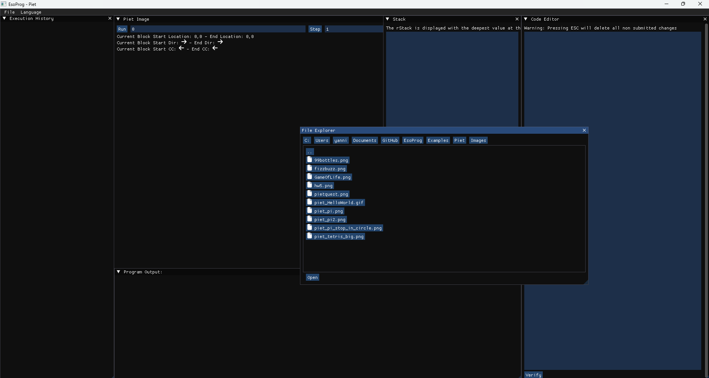
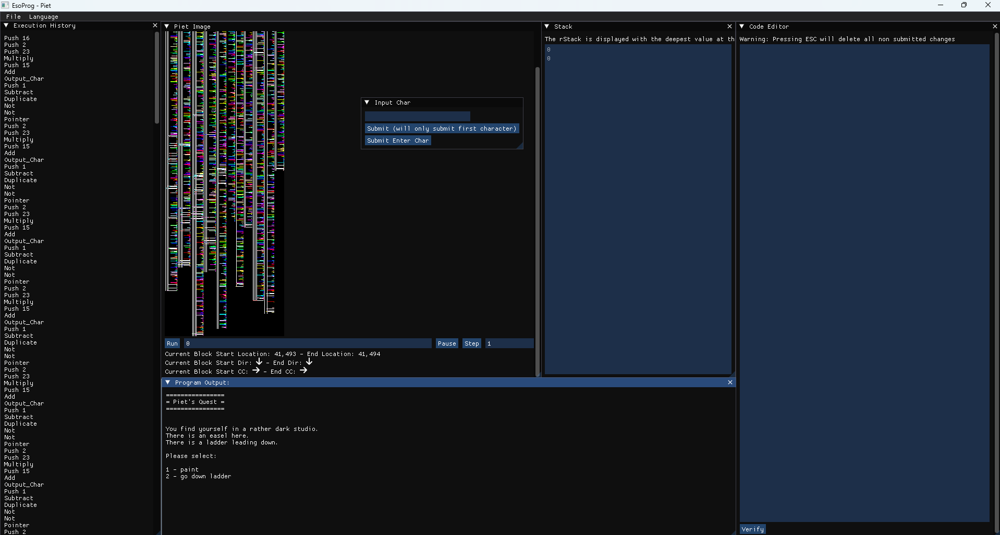

# EsoProg

EsoProg is intended to be a programming playground for esoteoric languages such as:

- :white_check_mark: Piet
- :white_large_square: BrainF*ck
- :white_large_square: COW
- :white_large_square: Auld

# How To Build
To build this program you must have vcpkg and cmake installed.
I then recommend you use visual studio to open the repro director and build from there.
